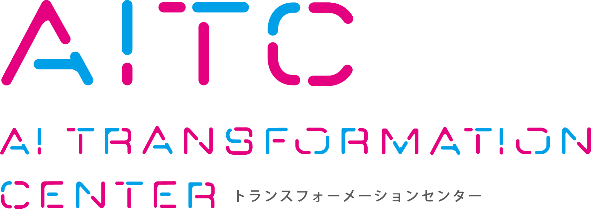

# Preference Descriptions for Dynamic Personalization of Large Language Models

## Author

<p>
  
</p>

Naofumi Osawa
AI Transformation Center (AITC), DENTSU SOKEN INC., Japan

## Abstract

Personalized generation with large language models requires not only high-quality outputs but also cost-effective use of user history. We present a focused empirical study of personalized review generation on Amazon Reviews 2023, comparing three deployment-compatible user-history representations: raw-history few-shot prompting, compact user profiles, and a deployment-oriented global parameter-efficient fine-tuning (PEFT) baseline. We evaluate these methods using automatic metrics, estimated API costs, user-retrieval analysis, and a human preference study. Raw-history few-shot prompting achieves the strongest automatic scores, but its gains saturate as more reviews are added while inference cost increases. Compact profiles preserve much of the semantic and perceived personalization quality while using substantially shorter prompts and lower operational cost. In contrast, a single global PEFT adapter without user-specific inference-time context shows limited personalization ability in this setting. We do not claim to introduce a new personalization architecture or a comprehensive cross-domain benchmark; rather, our results clarify practical cost--quality trade-offs for product-review generation under API-style deployment constraints.

## Paper

- **[Paper](</home/naofumi1014/WAIP2026-ICDM/paper/Raw Histories or Compact Profiles.pdf>)**
- Venue : IEEE ICDM International Workshop on AI for Personalization (WAIP)
  [lirio-brell.github.io/wain26](https://lirio-brell.github.io/wain26/)

## [TBD]Citation

If you find this work useful, please cite:

```bibtex
```

## URLs

- **Author**: https://naofumi1014.github.io/
- **DENTSU SOKEN**: https://www.dentsusoken.com/
- **AI Transformation Center (AITC)**: https://aitc.dentsusoken.com/

---

Note:The AITC logo is used for affiliation purposes only.
